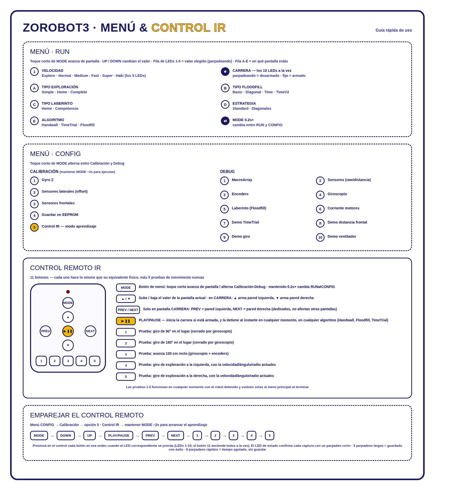

# Operativa General

El robot se maneja con el botón físico de menú (MODE / UP / DOWN) o con un
control remoto IR emparejado (ver imagen de arriba para el detalle completo
de pantallas, botones y el procedimiento de emparejamiento).

## Tipos de Inicio de Carrera

- **Tapando sensores** (método original): tapar el sensor frontal derecho
  inicia **EXPLORE**; tapar primero el derecho y luego el izquierdo inicia
  **EXPLORE & RUN**; tapar el izquierdo inicia **RUN** (correr un laberinto
  ya resuelto).
- **Con el control remoto IR**: elegir la pared a seguir (PREV/NEXT o UP/DOWN
  en la pantalla CARRERA) y presionar **PLAY/PAUSE** inicia la carrera con el
  algoritmo de exploración seleccionado en el menú. En Floodfill este método
  siempre explora un laberinto nuevo; para correr uno ya resuelto se sigue
  usando el método de tapar el sensor izquierdo.
- Presionar **PLAY/PAUSE** en cualquier momento, durante cualquier algoritmo,
  detiene el robot al instante.

## Tipos de Mapeo

- **EXPLORE_SIMPLE**: Mapea hasta llegar por primera vez a **GOAL**.
- **EXPLORE_HOME**: Mapea hasta llegar por primera vez a **GOAL** y luego mapea volviendo a **HOME**.
- **EXPLORE_COMPLETE**: Mapea hasta que no queden casillas sin visitar para la solución más óptima del algoritmo de mapeo seleccionado.

## Condiciones de comportamiento

- **EXPLORE_SIMPLE** y **EXPLORE_COMPLETE** volverán a la casilla de **HOME** al finalizar el mapeo _solo si_ se trata de una ejecución **EXPLORE & RUN**. En caso contrario, el robot se detendrá en **GOAL** o en la última casilla necesaria para la ruta óptima.
- **EXPLORE_HOME** siempre vuelve hasta la casilla de **HOME** aunque ya haya visitado todo el camino correspondiente.
- Se puede modificar el tipo de mapeo después del primer **EXPLORE & RUN**, por ejemplo para completar el mapeo existente en búsqueda de la ruta más óptima para un **RUN** posterior. (ver advertencias importantes)
- Al terminar cada acción de **RUN** el robot se detendrá en la casilla de **GOAL** esperando a ser recogido.

## Advertencias importantes

- **Se requiere reiniciar el robot** después de la ejecución de cada tipo de inicio (**EXPLORE**, **EXPLORE & RUN**, **RUN**).
- Si se pretende hacer un **EXPLORE_COMPLETE** como refinamiento de un mapeo anterior y se ha reiniciado el robot, **es necesario pulsar el botón de menú** una vez el robot esté armado en la pantalla CARRERA (los 10 LEDs fijos, esperando orden de arrancar) para **no borrar todo el mapeo anterior**.

